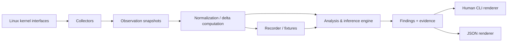
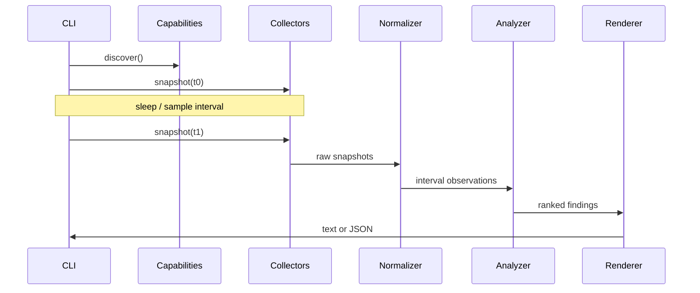
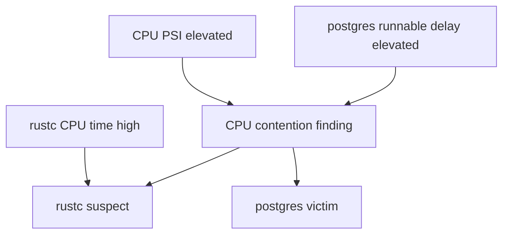

# Architecture

## Architectural objective

Keep **collection**, **normalization**, **analysis**, and **presentation** separate enough that:

- analysis can run against fixtures/replays,
- collectors can evolve without rewriting inference logic,
- CLI presentation does not leak into core reasoning,
- future eBPF telemetry can coexist with simple Linux interfaces,
- evidence remains inspectable.

## High-level pipeline



## Conceptual layers

### 1. Capability discovery

Determine which information sources are available and readable.

Examples:

- PSI present?
- `/proc/<pid>/schedstat` readable?
- task delay accounting available?
- cgroup v2 mounted?
- process I/O visible?
- privileged tracepoint/eBPF functionality available?

Capabilities are explicit data, not hidden assumptions.

### 2. Collectors

Collectors retrieve raw counters/gauges/events.

Collectors should perform minimal interpretation.

Examples:

- CPU PSI collector,
- global CPU collector,
- process stat collector,
- scheduler accounting collector,
- process I/O collector,
- diskstats collector,
- cgroup collector.

### 3. Observation model

Represent raw values at a point in monotonic time.

Counters remain counters.

Do not prematurely turn every value into a percentage.

### 4. Normalization

Compare snapshots and derive interval metrics:

- CPU time deltas,
- bytes/sec,
- runnable delay deltas,
- context-switch rates,
- pressure interval values,
- process lifetime changes,
- device queue deltas.

This layer must handle:

- process creation,
- process exit,
- PID reuse,
- counter reset/wrap where applicable,
- missing observations,
- different collector timings.

### 5. Analysis/inference

Consume normalized interval data and emit evidence-backed findings.

The inference engine should not read `/proc` directly.

### 6. Finding model

A finding contains:

- kind,
- resource,
- severity,
- confidence,
- observation interval,
- impact description,
- victims,
- suspects,
- evidence,
- limitations/qualifiers,
- optional recommended next probe.

### 7. Presentation

Render findings for:

- humans,
- JSON consumers.

Presentation should not recalculate the diagnosis.

## Proposed code boundaries

Do not force a multi-crate workspace immediately, but preserve these conceptual modules.

```text
src/
  main.rs
  cli/
  platform/
    linux/
      capabilities.rs
      procfs/
      psi.rs
      cgroup.rs
      disk.rs
  model/
    ids.rs
    observation.rs
    normalized.rs
    evidence.rs
    finding.rs
  analysis/
    cpu.rs
    memory.rs
    io.rs
    scoring.rs
  render/
    text.rs
    json.rs
```

If compile times, ownership boundaries, reuse or eBPF components justify it later, split into crates.

## Current implementation layout

Milestones 1–5 combine bounded CPU/process, memory-context, I/O-context, PSI,
cgroup, and recording/replay paths with typed inference/output boundaries:

```text
src/
  analysis.rs   # pure normalized CPU inference and typed findings
  main.rs       # process entry point and exit behavior
  cli.rs        # command/options model and duration parsing
  cpu.rs        # procfs CPU/process snapshots and interval normalization
  io.rs         # bounded diskstats and process I/O-accounting intervals
  memory.rs     # bounded host meminfo/vmstat snapshots and intervals
  observe.rs    # sequential bounded multi-resource observation orchestration
  psi.rs        # CPU, memory, and I/O PSI parsing, capabilities, and intervals
  record.rs     # versioned normalized-observation recordings and redaction
  render.rs     # concise finding-first text and full-evidence JSON rendering
tests/
  cli.rs                # executable-level behavior tests
  cpu_acceptance.rs     # ignored bounded rootless live-pressure acceptance test
  fixtures/             # deterministic procfs and renderer fixtures
tools/
  measure-overhead.sh   # opt-in scenario-based release-binary harness
```

There is no generic telemetry framework. `cpu.rs` keeps the narrow procfs
CPU/process raw and interval model together; it deliberately aggregates stable
task schedstat counters but does not assign attribution roles. `analysis.rs` is
a narrow pure boundary that consumes only normalized
PSI and CPU/process interval observations and emits typed serializable CPU
findings. A valid PSI interval is sufficient for the CPU resource verdict;
failed CPU/process context becomes qualification and removes attribution rather
than invalidating PSI. Procfs remains outside analysis and renderers do not
recompute rules. The text renderer is intentionally concise; JSON retains the
complete structured observation, evidence, roles, and collection qualifiers.

The M2 path keeps memory PSI separate from memory context. `observe.rs` reads
all start snapshots, performs one requested sleep, then reads end snapshots;
each CPU PSI, memory PSI, CPU/process, and memory-context pair has its own
monotonic interval because the reads are sequential. Memory PSI `some` is the
resource-verdict boundary. Memory `full` is a separately validated subset of
`some`, never additive evidence. `/proc/meminfo` and `/proc/vmstat` only add
mechanism/context qualifiers. The collector performs no PID walk for memory, so
the initial host-wide finding deliberately has no process attribution. VM rates
use the independently measured memory-context interval; mechanism confidence is
separate from pressure confidence.

M3 keeps exact I/O PSI separate from disk/process I/O activity. Diskstats and
`/proc/<pid>/io` are sequentially collected across the same single sleep but
retain independent monotonic intervals. The observer bounds diskstats to 4,096
devices and 1 MiB of input, and process I/O to 1,024 PIDs using a stat-io-stat
identity check (at most 3,072 file reads per endpoint). Disk/device and process candidates are
same-window activity only; the slice does not identify stalled-workload victims,
map processes to devices, or claim a causal path. Its controlled acceptance
validates that bounded rootless competing I/O can produce the PSI-backed resource
finding and candidates, not those unsupported attribution claims.

M4 implements ADR-0006's cgroup-v2-only, membership-first collector: it
discovers the actual cgroup2 mount from mountinfo, reads the unified `0::`
membership form, and maps a bounded selected PID set by `stat` → cgroup →
`stat` identity checks. It collects only mapped cgroups and ancestors under
explicit PID, group, depth, path, and file-byte budgets. Per-cgroup exact PSI
is an explicitly scoped verdict; CPU, memory, and I/O controller deltas remain
qualified context. One typed completeness assessment drives standalone
capabilities, hunt JSON, and hunt completeness, so partial controller files,
permissions, budgets, and lifecycle loss cannot be presented as complete.
Path-derived systemd names are optional inferred metadata, without D-Bus or a
systemd runtime dependency.

M5 adds a recording envelope distinct from hunt JSON (ADR-0007). `record.rs`
serializes normalized interval observations with explicit microsecond
durations, typed observed/unavailable resource slots, and optional identifier
redaction. `replay` reconstructs `HuntObservation` and reuses the existing
analyzer and renderers. Unknown `kind` or `schema_version` values are rejected.

## Observation lifecycle

A bounded hunt might behave as follows:



The first version may use two snapshots. Later versions can use a sequence of samples to calculate distributions and avoid transient misclassification.

## Sampling architecture

Eventually distinguish:

### Low-frequency gauges/counters

Suitable for 500 ms–2 s polling:

- PSI,
- CPU time,
- process CPU counters,
- process I/O counters,
- memory counters,
- diskstats.

### High-frequency/event telemetry

Suitable for tracepoints/perf/eBPF:

- scheduler wakeup-to-run latency,
- off-CPU stack attribution,
- futex contention,
- block request latency,
- syscall blocking,
- socket events.

Do not poll event-like phenomena at absurd frequency merely to avoid eBPF.

## Entity model

The analysis engine should reason about entities using stable internal keys.

Potential entities:

- host,
- CPU,
- process,
- thread,
- cgroup,
- systemd unit,
- container,
- block device,
- network interface,
- socket (later).

A user-visible process identity should not be just a PID because of PID reuse.

Use something analogous to:

```text
ProcessKey {
    pid,
    start_time_ticks
}
```

where start time comes from `/proc/<pid>/stat`.

## Process tree and grouping

Process attribution should support multiple views:

- process,
- executable/command,
- process tree,
- cgroup,
- systemd unit,
- container.

Do not sum unrelated short-lived processes solely by command name without making that aggregation explicit.

## Cgroup design

M4 will use cgroup v2 only (ADR-0006). It will discover the mounted hierarchy rather
than assuming `/sys/fs/cgroup`, uses the unified `0::` membership entry, and
reads selected mapped cgroups plus ancestors rather than an arbitrary tree.

Cgroups are important because a "cause" or "victim" is often better expressed as:

```text
system.slice/postgresql.service
```

than as dozens of PIDs.

Exact per-cgroup PSI is a finding only about that cgroup's scope. CPU, memory,
and I/O controller counters provide scoped context but do not create a pressure
verdict by themselves. A cgroup path or path-derived systemd unit candidate is
not evidence that the cgroup caused any other cgroup's delay. Missing controllers
and permissions are capability/collection qualifiers.

## Evidence graph

The internal model should support linking observations rather than flattening everything immediately.

Example:



A fully generic graph database is not required.

A lightweight typed evidence structure is sufficient.

## Data ownership

Prefer immutable normalized snapshots passed into analyzers.

Benefits:

- easier testing,
- reproducibility,
- fewer temporal bugs,
- deterministic re-analysis.

Collectors may be stateful where necessary but analysis should not depend on hidden collector state.

## Concurrency

Do not introduce async automatically.

Initial collectors can run synchronously unless:

- collection latency becomes material,
- independent collectors need concurrent sampling alignment,
- event streams require an async/event architecture.

If an async runtime is later introduced, record the decision as an ADR.

## Portability boundary

Linux-specific code belongs behind a platform boundary.

However, do not distort the domain model to pretend all operating systems expose identical semantics.

"CPU PSI" is a Linux capability and may remain represented as such.

## Failure model

Collection is best-effort and partial.

A snapshot can legitimately contain:

- global CPU data but no scheduler data,
- PSI but no per-process details,
- process details for only readable PIDs,
- cgroup metrics but not container metadata.

The analyzer must understand data availability.

Absence of data is not evidence of absence of a bottleneck.

## Extensibility rule

New telemetry should be added because it improves a concrete diagnosis.

Desired flow:

1. identify diagnostic ambiguity,
2. define evidence needed to reduce it,
3. identify kernel interface,
4. add collector,
5. normalize,
6. incorporate into a finding,
7. test before/after confidence behavior.

Avoid collecting metrics "because they might be useful later."
