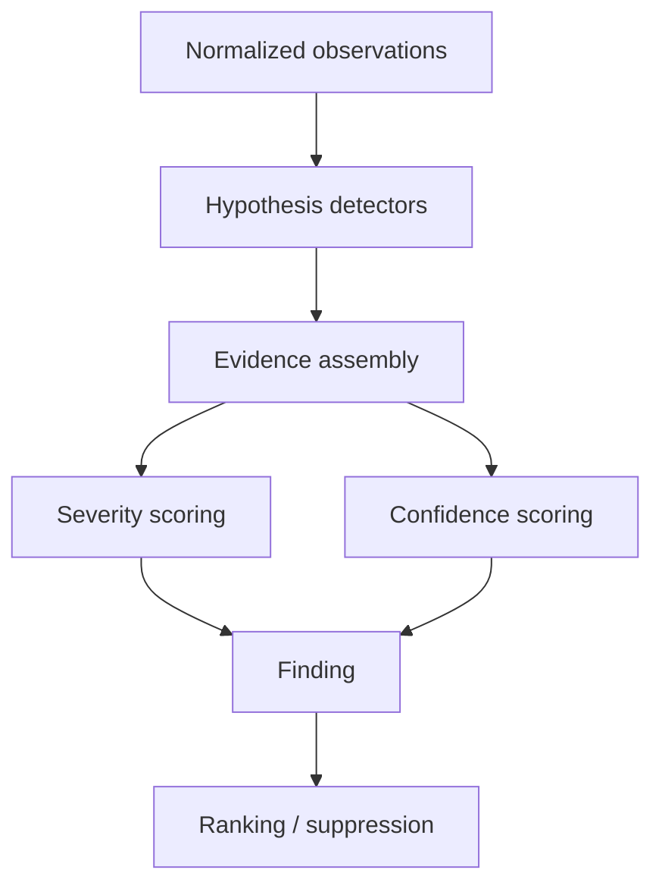

# Inference engine

## Purpose

Turn normalized telemetry into conservative, explainable performance findings.

The inference engine is the project's distinguishing feature.

## Design rule

A metric crossing a threshold is not automatically a diagnosis.

A strong finding should combine several layers:

1. **contention evidence** — proof that progress is being stalled,
2. **impact evidence** — indication that the stall matters,
3. **victim evidence** — workloads losing progress,
4. **suspect evidence** — workloads consuming/contending for the constrained resource,
5. **qualifiers** — missing or contradictory evidence.

## Inference pipeline



## Hypotheses

Each analyzer evaluates resource-specific hypotheses.

Initial CPU hypotheses:

- no meaningful CPU contention,
- CPU scheduler contention exists,
- specific tasks are suffering runnable delay,
- specific tasks are likely major contributors.

Later memory hypotheses:

- high memory occupancy without meaningful pressure,
- reclaim pressure,
- swapping pressure,
- likely memory-thrashing behavior.

Later I/O hypotheses:

- meaningful I/O pressure,
- device-level latency/saturation,
- likely process/cgroup contributor.

## Implemented M4 cgroup scope rule

M4 adds bounded cgroup-v2 evidence without changing the existing host verdict
rules. A valid exact interval from a cgroup's own PSI file supports a
finding about that cgroup scope; it does not establish host pressure, or vice
versa. Per-cgroup `full` is non-additive subset context.

Per-cgroup `cpu.stat`, memory, and I/O controller measurements explain activity
only after a scoped PSI verdict, subject to collection qualifiers. They do not
rank findings independently of PSI. Membership and same-window activity may
identify a scoped workload for the operator, but cannot prove it caused another
cgroup's delay. An inferred systemd unit name remains label metadata, not a
causal or manager-authoritative claim.

## CPU v0.1 inference

### Step 1: establish contention

Strong evidence:

- CPU PSI interval `some` fraction materially above baseline.

Supporting evidence:

- runnable task count elevated relative to CPU count,
- high aggregate CPU utilization.

Do not report CPU contention solely because utilization is near 100%.

### Step 2: estimate impact

Potential measures:

- CPU PSI fraction during observation,
- absolute stalled duration,
- number of affected tasks,
- per-task runnable delay deltas.

### Step 3: find victims

If schedstat is available, rank processes by added runnable delay.

Possible derived metric:

```text
victim_ratio = runnable_delay / observation_duration
```

Take care with multithreaded processes: summed thread/process metrics can exceed wall-clock fractions.

The user-facing explanation should state what is being summed.

### Step 4: find suspects

Rank concurrent CPU consumers by CPU time consumed over the same interval.

A suspect score might consider:

```text
consumer_share × overlap_with_pressure × scope_relationship
```

Early versions may not know exact temporal overlap inside a coarse two-snapshot window.

If so, say attribution is based on consumption during the same observation interval.

### Step 5: assign confidence

Example conceptual logic:

High confidence CPU contention:

- PSI clearly elevated,
- scheduler delay corroborates,
- observation interval sufficiently long.

High confidence suspect attribution requires stronger evidence than high confidence resource diagnosis.

It is valid to output:

```text
CPU contention: confidence HIGH
Primary suspect rustc: confidence MEDIUM
```

## Severity model

Severity should be explainable and centralized.

Avoid pretending one threshold works for all machines/workloads.

Initial approach may use configurable piecewise thresholds based primarily on pressure fraction.

Example only:

```text
< 1%       none/low
1-5%       low
5-15%      moderate
15-30%     high
> 30%      severe
```

### Implemented M1.5 CPU rule

Only a valid exact-interval CPU PSI `some` fraction produces the CPU resource
verdict. The effective diagnostic and resource-confidence window is the shorter
of requested duration and measured PSI interval; a requested duration below one
second remains smoke mode. Otherwise, for an effective window of at least one
second, `<1%` is an explicit no-meaningful-contention finding; `[1,5)%`,
`[5,15)%`, `[15,30)%`, and `>=30%` map to low, moderate, high, and severe.
CPU utilization >=90% and runnable tasks greater than logical CPU count are
supporting/contradictory context only. An effective 5s window has high resource
confidence; 1s..<5s has medium. Valid PSI continues to produce the resource
verdict when host/process context is unavailable; attribution is empty and
qualified. Absent or invalid PSI produces no assessment.

When contention exists, positive stable schedstat delay is ranked descending
then `ProcessKey` (top five) as observed runnable-delay victim candidates, not
proof of user-visible harm. Same-window consumers >=25% of one CPU are ranked
the same way (top three) as correlation-only suspects. Their confidence is at
most medium without event telemetry; consumers within 10% are non-unique.

These values must be validated and should not be enshrined without tests/experiments.

Severity may be adjusted using:

- sustained duration,
- number of victims,
- "full" pressure,
- latency-sensitive target information later.

Document final thresholds when implemented.

### Implemented M2 memory rule

Only valid exact-interval memory PSI `some` establishes a memory verdict. The
effective window is the shorter of requested and measured memory-PSI duration:
below one second is insufficient; 1s..<5s has medium resource confidence; at
least 5s has high confidence. The provisional `<1%`, `1/5/15/30%` severity
bands are shared with CPU. Below 1% reports no harmful pressure even when
occupancy is high or swap is allocated.

For active PSI pressure, positive swap-in classifies correlated swap pressure;
positive direct scan and direct steal classify correlated reclaim pressure;
otherwise the mechanism remains generic active pressure. These same-window
mechanism labels have low confidence independently of the PSI-backed pressure
confidence. Possible thrashing requires high/severe `some`, at least 1% valid
`full`, a 5s effective PSI window, and at least 1,024 pages/second in each of
direct scan, direct steal, swap-in, and swap-out over the independent vmstat
interval. Its mechanism confidence is capped at medium. The threshold is
provisional and the conclusion remains explicitly heuristic. Memory `full` is
a non-additive subset of `some`, so it never increases the PSI fraction or
independently establishes pressure. Meminfo/vmstat are classification/context
only. This is host-wide evidence: M2 emits no victims, suspects, or causal
process claims.

### Implemented M3 I/O rule

Only valid exact-interval I/O PSI `some` establishes block-I/O pressure. The
effective requested/measured window and provisional `<1%`, `1/5/15/30%` bands
match CPU and memory: below one second is insufficient, 1s..<5s medium
confidence, and at least 5s high confidence. High disk/process activity with
`some <1%` remains a no-meaningful-contention result. I/O `full` is a
non-additive subset and can qualify context but cannot independently create or
increase a verdict.

When pressure exists, positive stable diskstats and process I/O-accounting deltas
are ranked as same-window candidates only. They do not identify affected
workloads, map a process to a device, or prove the process/device caused PSI
stall. Charged writes and cancelled writes remain separate and are not treated
as confirmed device writeout. Missing, partial, reset, and capped context lowers
candidate confidence or removes candidates without discarding valid PSI
pressure evidence.

## Confidence model

Confidence reflects evidence quality.

Possible evidence weights:

### Positive

- direct PSI stall evidence,
- per-task delay,
- direct device latency,
- cgroup-local pressure matching affected workload,
- event-level tracing.

### Negative

- telemetry unavailable,
- short observation window,
- weak temporal resolution,
- attribution only from global coincidence,
- layered devices obscure ownership,
- multiple indistinguishable consumers,
- contradictory metrics.

Do not expose "93%" unless it has a defensible probabilistic meaning.

Prefer qualitative levels initially.

## Evidence independence

Avoid double-counting highly correlated measurements.

Example:

- `/proc/stat` CPU utilization and summed process CPU time are related views of the same underlying CPU consumption.
- PSI provides different information: stalled work.

A confidence score should not become artificially high because the same phenomenon is counted three ways.

## Contradictory evidence

The engine should actively look for evidence against a hypothesis.

Example:

```text
Hypothesis: memory bottleneck

For:
- memory occupancy 96%

Against:
- memory PSI ~0
- no swap-in/out
- no meaningful reclaim
- MemAvailable remains adequate

Conclusion:
- no evidence of active memory bottleneck
```

This is central to the product's credibility.

## Finding ranking

Default ranking should consider:

1. severity,
2. confidence,
3. affected scope,
4. directness of evidence.

A severe low-confidence finding may still appear first, but its uncertainty must remain visible.

## Finding suppression

Avoid overwhelming the user with redundant findings.

Example:

If "CPU scheduler contention" is the parent finding, do not emit separate top-level findings for each victim unless they reveal a distinct issue.

Use nested evidence/attribution.

## Multi-resource interactions

Resources can cause secondary symptoms.

Examples:

- memory reclaim can generate I/O pressure,
- I/O stalls can reduce CPU utilization,
- lock contention can leave CPUs underutilized,
- CPU pressure can delay I/O-submission threads.

Do not force each finding into mutually exclusive categories.

Long-term, the evidence model should permit relationships:

```text
memory pressure
    -> writeback/reclaim I/O
        -> storage pressure
            -> database victim
```

Unimplemented paths still appear as independent findings with qualifiers.
The first implemented relation (ADR-0009) is narrower: a memory mechanism
label plus I/O pressure may be related as `consistent_with` when both findings
already exist. Coincident PSI without VM-counter mechanism evidence does not
create a chain. Confidence is never high. The relation does not replace the
independent memory and I/O verdicts, map processes to devices, or prove that
reclaim caused the I/O stalls.

## Baselines

Avoid requiring historical baselines for core functionality.

The tool should work on first run.

Later features may compare against:

- earlier part of same observation,
- saved recordings,
- rolling local baseline.

M6 watch compares consecutive windows only to classify finding lifecycle. It
does not introduce a historical baseline, and a resolved finding is not proof
that the machine is healthy beyond the current window.

Core findings should remain grounded in absolute contention/stall evidence where possible.

## Rule implementation style

Prefer explicit, testable analyzers over a generic DSL initially.

Example:

```rust
fn analyze_cpu(input: &NormalizedObservation) -> Vec<Finding>
```

A rule DSL/plugin engine is only justified if repetition or user customization creates real demand.

## Explanation requirements

Every top-level finding should be explainable as a short chain:

```text
Observation:
CPU PSI shows runnable work stalled for 22% of the interval.

Impact:
postgres accumulated 1.8 s of runnable delay.

Attribution:
rustc consumed 5.9 CPU-seconds on an 8-CPU host during the same interval.

Conclusion:
CPU scheduler contention is active.
postgres is an affected workload.
rustc is a likely major contributor.

Limit:
The MVP does not trace exact wakeup-to-run overlap, so suspect causality is medium confidence.
```

If the implementation cannot generate an explanation like this from its stored evidence, the model is too opaque.
